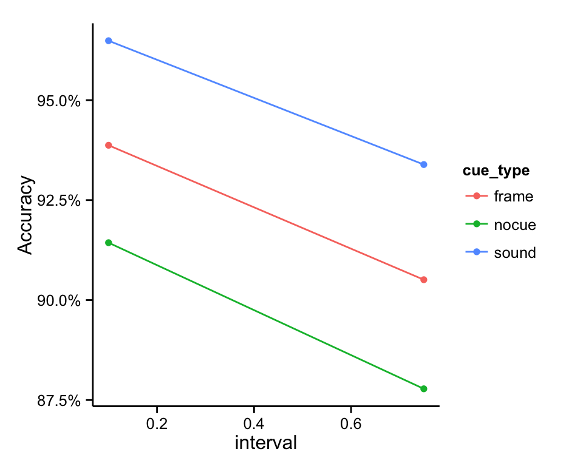
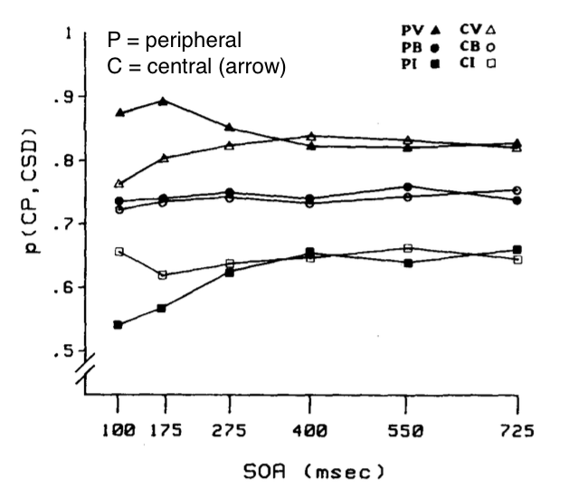
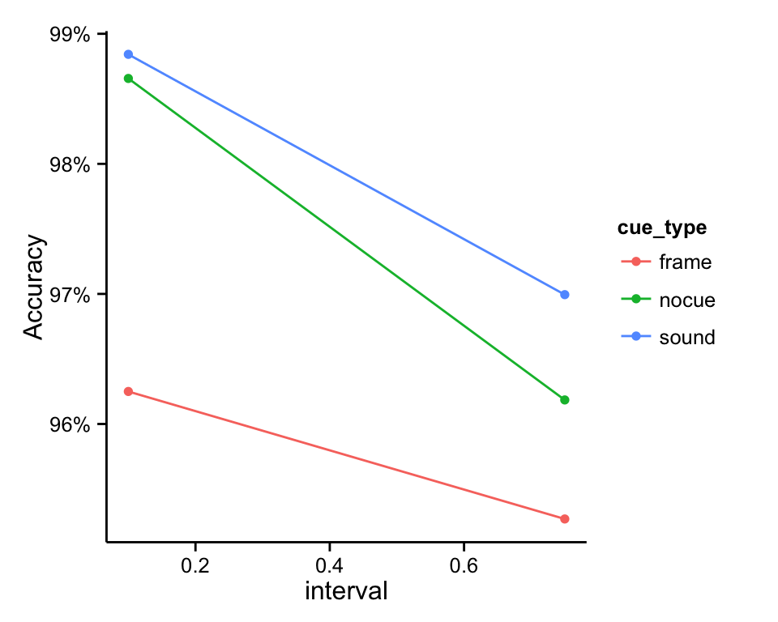

The most interesting thing we’ve found so far is that verbal cues result in a larger cueing effect than the peripheral visual cues when the mask is flashing.

## Mean accuracies when mask is flashing

I’d like to interpret this difference as evidence that verbal cueing is more robust to irrelevant visual information, but that explanation is inadequate for a number of reasons.

The easiest explanation for why peripheral visual cues weren’t as effective as verbal cues is that the mask, which remained flashing over the course of the trial, made it harder to see the peripheral visual cue. On some trials people might have missed the peripheral visual cue, but they were always heard the verbal cue, which might lead to differences in cueing effects due to cue salience and not anything about the representations being activated by the different types of cues.

I could address this issue by including some catch trials where people have to remember which direction was cued. Hopefully we would find that people remember the verbal cues just as often as they remember the peripheral visual cues.

A bigger problem is that the advantage of verbal cues over peripheral visual cues particularly at short delays is unexpected. The typical finding (e.g., Muller & Rabbit, 1989) is that exogenous cues are more effective than endogenous cues at short intervals.

That the results are unexpected is only interesting if we can show that it is due to the mask. I thought that by turning off the mask we would find the normal pattern (exogenous \> endogenous at short delays, exogenous = endogenous at long delays), but that’s not what we found. Even with the mask off, we still found an advantage of verbal cueing over peripheral visual cueing at both delays.[^1]

## Mean accuracies when mask is not flashing

There are two reasons this might be happening.

  1. There weren’t any invalid cues. There **were** trials where there was a cue and no target, but there **were not** any trials where the cue was to the left and the target appeared to the right.
  2. The intervals are measured from cue offset rather than cue onset. It’s possible that at shorter delays the difference between verbal and peripheral visual cues will disappear or reverse.

So the simplest next step is to run the experiment again with the addition of invalid cues and manipulating SOA correctly. Hopefully we’ll find that verbal cues are more effective than peripheral visual cues when the target is masked, but when the target is not masked, the two are equal.

[^1]:	We also found that without the mask, peripheral visual cues actually exhibited a negative cueing effect, which is really confusing.